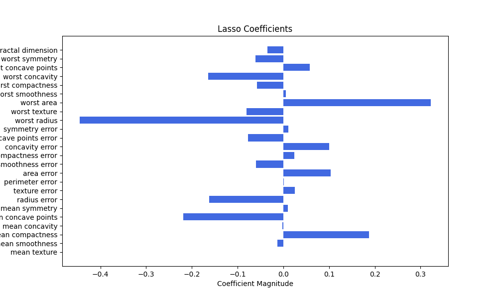
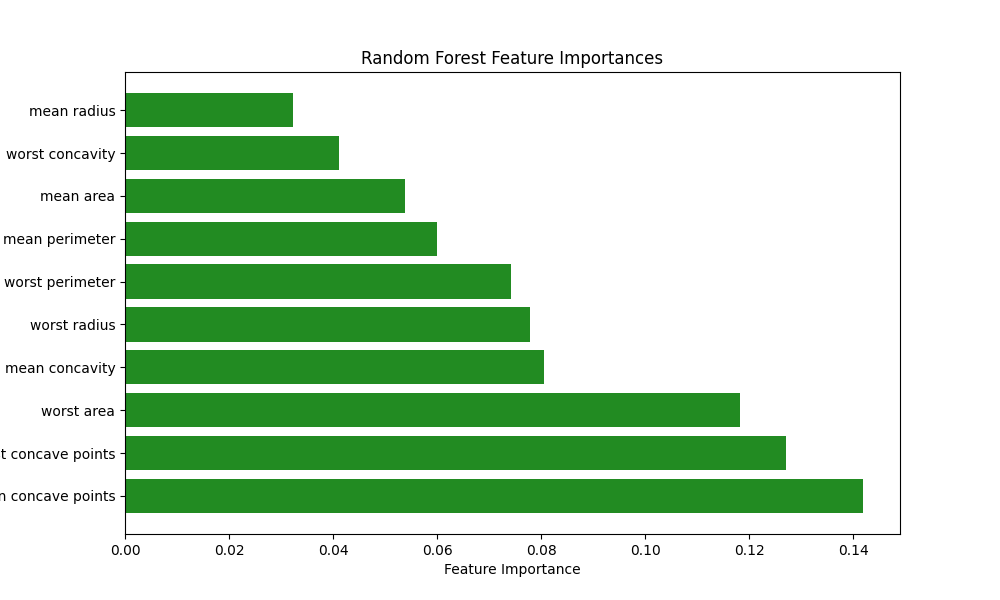
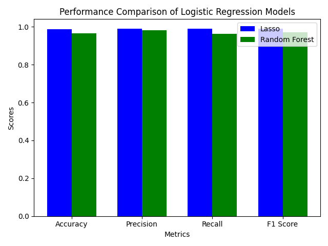

# Breast Cancer Classification with Embedded Feature Selection

This repository showcases a machine learning project focused on classifying breast cancer diagnoses using embedded feature selection techniques. We utilize Lasso Regression and Random Forest to identify and evaluate important features impacting prediction outcomes while maintaining model interpretability.

## Objective

The goal is to demonstrate how embedded methods can effectively identify and evaluate significant features during model training on the **Breast Cancer Wisconsin dataset** for binary classification.

## 1. Dataset Overview

- **Dataset**: Breast Cancer Wisconsin
- **Number of Features**: 30
- **Type of Features**: Continuous
- **Target Variable**: Diagnosis (malignant or benign)

### Loading the Dataset

```python
import pandas as pd
from sklearn.datasets import load_breast_cancer

# Load the breast cancer dataset
cancer_data = load_breast_cancer()
X = pd.DataFrame(cancer_data.data, columns=cancer_data.feature_names)
y = pd.Series(cancer_data.target)

# Data overview
print(X.info())
print(X.head())
print(y.value_counts())
```

## 2. Model Selection

### Model Choices and Justification

1. **Lasso Regression**: Utilizes L1 regularization to perform feature selection by shrinking some coefficients to zero, effectively excluding those features.
2. **Random Forest**: A tree-based ensemble method that ranks features by importance, calculated by their impact on reducing impurity in splits.

## 3. Embedded Technique Application

### 1. Lasso Regression

```python
from sklearn.linear_model import LassoCV
from sklearn.preprocessing import StandardScaler

# Standardize the features
scaler = StandardScaler()
X_train_scaled = scaler.fit_transform(X_train)

# Initialize and fit Lasso regression
lasso = LassoCV(cv=5, random_state=42).fit(X_train_scaled, y_train)

# Retrieve non-zero coefficient features
lasso_selected_features = X_train.columns[lasso.coef_ != 0]
print("Selected features by Lasso:", lasso_selected_features)

# Visualize feature coefficients
plt.figure(figsize=(10, 6))
plt.barh(lasso_selected_features, lasso.coef_[lasso.coef_ != 0], color="royalblue")
plt.xlabel("Coefficient Magnitude")
plt.ylabel("Features")
plt.title("Lasso Coefficients")
plt.savefig("lasso_coefficients.png")
plt.show()
```



### 2. Tree-Based Method (Random Forest)

```python
from sklearn.ensemble import RandomForestClassifier

# Initialize and fit Random Forest Classifier
rf = RandomForestClassifier(random_state=42)
rf.fit(X_train, y_train)

# Feature importance extraction
importances = rf.feature_importances_
indices = np.argsort(importances)[::-1]

# Visualize feature importances
plt.figure(figsize=(10, 6))
plt.barh(X_train.columns[indices][:10], importances[indices][:10], color="forestgreen")
plt.xlabel("Feature Importance")
plt.ylabel("Features")
plt.title("Random Forest Feature Importances")
plt.savefig("tree_feature_importances.png")
plt.show()
```



## 4. Model Performance Evaluation

### Model Performance with Lasso Features

```python
from sklearn.linear_model import LogisticRegression
from sklearn.metrics import accuracy_score, precision_score, recall_score, f1_score

# Subset data with Lasso-selected features
X_train_lasso = X_train[lasso_selected_features]
X_test_lasso = X_test[lasso_selected_features]

# Scale the Lasso features
X_train_lasso_scaled = scaler.fit_transform(X_train_lasso)
X_test_lasso_scaled = scaler.transform(X_test_lasso)

# Train Logistic Regression on Lasso-selected features
model_lasso = LogisticRegression(max_iter=200)
model_lasso.fit(X_train_lasso_scaled, y_train)
y_pred_lasso = model_lasso.predict(X_test_lasso_scaled)

# Model performance with Lasso features
lasso_metrics = {
    "Accuracy": accuracy_score(y_test, y_pred_lasso),
    "Precision": precision_score(y_test, y_pred_lasso),
    "Recall": recall_score(y_test, y_pred_lasso),
    "F1 Score": f1_score(y_test, y_pred_lasso),
}

print("Lasso-selected Features Performance:")
print("Accuracy:", lasso_metrics["Accuracy"])
print("Precision:", lasso_metrics["Precision"])
print("Recall:", lasso_metrics["Recall"])
print("F1 Score:", lasso_metrics["F1 Score"])
```

### Model Performance with Random Forest Features

```python
# Subset data with top 10 Random Forest-selected features
top_rf_features = X_train.columns[indices[:10]]
X_train_rf = X_train[top_rf_features]
X_test_rf = X_test[top_rf_features]

# Scale the Random Forest features
X_train_rf_scaled = scaler.fit_transform(X_train_rf)
X_test_rf_scaled = scaler.transform(X_test_rf)

# Train Logistic Regression on Random Forest-selected features
model_rf = LogisticRegression(max_iter=200)
model_rf.fit(X_train_rf_scaled, y_train)
y_pred_rf = model_rf.predict(X_test_rf_scaled)

# Model performance with Random Forest features
rf_metrics = {
    "Accuracy": accuracy_score(y_test, y_pred_rf),
    "Precision": precision_score(y_test, y_pred_rf),
    "Recall": recall_score(y_test, y_pred_rf),
    "F1 Score": f1_score(y_test, y_pred_rf),
}

print("\nRandom Forest-selected Features Performance:")
print("Accuracy:", rf_metrics["Accuracy"])
print("Precision:", rf_metrics["Precision"])
print("Recall:", rf_metrics["Recall"])
print("F1 Score:", rf_metrics["F1 Score"])
```

### Performance Results

- **Lasso-selected Features Performance**:
  - Accuracy: 0.9883
  - Precision: 0.9907
  - Recall: 0.9907
  - F1 Score: 0.9907

- **Random Forest-selected Features Performance**:
  - Accuracy: 0.9649
  - Precision: 0.9811
  - Recall: 0.9630
  - F1 Score: 0.9720

### Performance Comparison

```python
# Prepare data for plotting
metrics = list(lasso_metrics.keys())
lasso_scores = list(lasso_metrics.values())
rf_scores = list(rf_metrics.values())

# Plotting
x = range(len(metrics))  # x positions for the bars
width = 0.35  # width of the bars

fig, ax = plt.subplots()
bars1 = ax.bar(x, lasso_scores, width, label='Lasso', color='b')
bars2 = ax.bar([p + width for p in x], rf_scores, width, label='Random Forest', color='g')

# Adding labels and title
ax.set_xlabel('Metrics')
ax.set_ylabel('Scores')
ax.set_title('Performance Comparison of Logistic Regression Models')
ax.set_xticks([p + width / 2 for p in x])
ax.set_xticklabels(metrics)
ax.legend()

# Save the figure
plt.tight_layout()
plt.savefig('logistic_regression_performance_comparison.png')
plt.show()
```



## 5. Comparison with Filter and Wrapper Methods

- **Filter Methods**: Independent of models, quick, but may overlook feature interactions.
- **Wrapper Methods**: More accurate through subset evaluation but computationally expensive.
- **Embedded Methods**: Balance efficiency and accuracy, performing feature selection during model training.

## Documentation and Conclusion

Each step in the notebook includes comments for clarity, focusing on:

- **Feature Importance**: Variability of selected features across methods.
- **Performance**: Impact of selected features on model performance metrics.

This project highlights the practical utility of embedded methods, particularly for real-world applications where interpretability and efficiency are crucial. Feel free to explore the code and adapt it for your own use!
