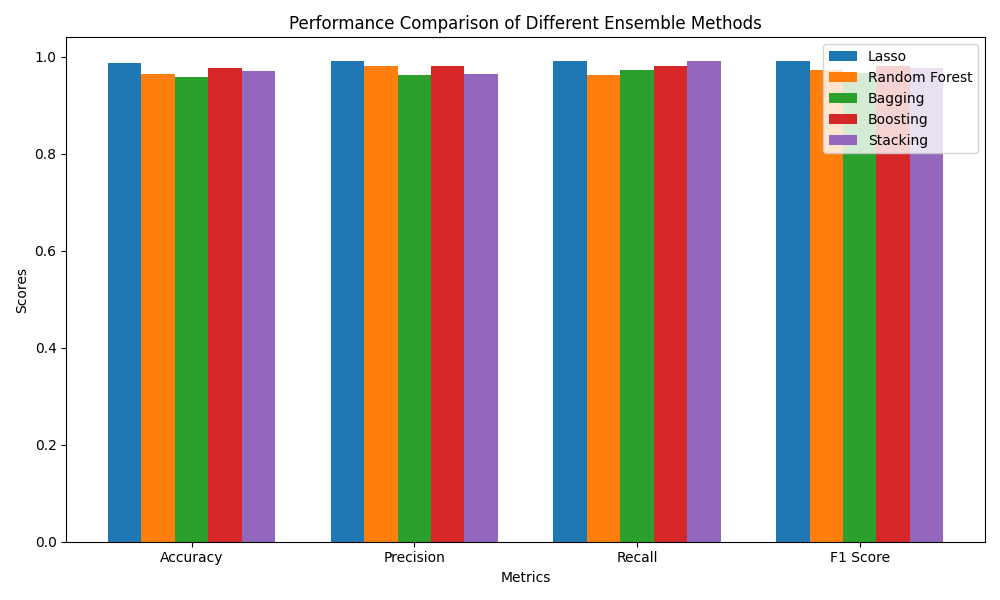

# Breast Cancer Classification with Embedded Feature Selection

This repository demonstrates a machine learning project that applies embedded feature selection techniques for classifying breast cancer diagnoses using the **Breast Cancer Wisconsin dataset**. We explore how embedded methods can identify and evaluate important features during model training, improving model performance and interpretability.

## Objective

The goal is to showcase the effectiveness of embedded feature selection methods, specifically **Lasso Regression** and **Random Forest**, for selecting relevant features while building a classification model. We evaluate the impact of these selected features on model performance and compare them to other ensemble methods, such as **Bagging**, **Boosting**, and **Stacking**.

## 1. Dataset Overview

- **Dataset**: Breast Cancer Wisconsin (from the UCI Machine Learning Repository)
- **Number of Features**: 30
- **Type of Features**: Continuous
- **Target Variable**: Diagnosis (malignant or benign)
- **Objective**: Identify important features for improving prediction accuracy, while maintaining model interpretability.

### Loading and Overview of the Dataset

```python
import pandas as pd
from sklearn.datasets import load_breast_cancer

# Load the breast cancer dataset
cancer_data = load_breast_cancer()
X = pd.DataFrame(cancer_data.data, columns=cancer_data.feature_names)
y = pd.Series(cancer_data.target)

# Data overview
print(X.info())
print(X.head())
print(y.value_counts())
```

## 2. Model Selection

### Model Choices and Justification

1. **Lasso Regression**: Utilizes L1 regularization to perform feature selection by shrinking some coefficients to zero, thereby excluding those features.
2. **Random Forest**: A tree-based ensemble method that ranks features by importance, based on how they impact the reduction of impurity during splits.

In addition to the embedded feature selection models, we compare the performance of these methods with three ensemble models:

- **Bagging**
- **Boosting**
- **Stacking**

## 3. Embedded Technique Application

### 1. **Lasso Regression**

```python
from sklearn.linear_model import LassoCV
from sklearn.preprocessing import StandardScaler

# Standardize features
scaler = StandardScaler()
X_train_scaled = scaler.fit_transform(X_train)

# Initialize and fit Lasso regression
lasso = LassoCV(cv=5, random_state=42).fit(X_train_scaled, y_train)

# Retrieve non-zero coefficient features
lasso_selected_features = X_train.columns[lasso.coef_ != 0]
print("Selected features by Lasso:", lasso_selected_features)

# Visualize feature coefficients
plt.figure(figsize=(10, 6))
plt.barh(lasso_selected_features, lasso.coef_[lasso.coef_ != 0], color="royalblue")
plt.xlabel("Coefficient Magnitude")
plt.ylabel("Features")
plt.title("Lasso Coefficients")
plt.savefig("lasso_coefficients.png")
plt.show()
```

### 2. **Tree-Based Method (Random Forest)**

```python
from sklearn.ensemble import RandomForestClassifier

# Initialize and fit Random Forest Classifier
rf = RandomForestClassifier(random_state=42)
rf.fit(X_train, y_train)

# Feature importance extraction
importances = rf.feature_importances_
indices = np.argsort(importances)[::-1]

# Visualize feature importances
plt.figure(figsize=(10, 6))
plt.barh(X_train.columns[indices][:10], importances[indices][:10], color="forestgreen")
plt.xlabel("Feature Importance")
plt.ylabel("Features")
plt.title("Random Forest Feature Importances")
plt.savefig("tree_feature_importances.png")
plt.show()
```

## 4. Model Performance Evaluation

### Performance with **Lasso-selected Features**

```python
from sklearn.linear_model import LogisticRegression
from sklearn.metrics import accuracy_score, precision_score, recall_score, f1_score

# Subset data with Lasso-selected features
X_train_lasso = X_train[lasso_selected_features]
X_test_lasso = X_test[lasso_selected_features]

# Scale the Lasso features
X_train_lasso_scaled = scaler.fit_transform(X_train_lasso)
X_test_lasso_scaled = scaler.transform(X_test_lasso)

# Train Logistic Regression on Lasso-selected features
model_lasso = LogisticRegression(max_iter=200)
model_lasso.fit(X_train_lasso_scaled, y_train)
y_pred_lasso = model_lasso.predict(X_test_lasso_scaled)

# Model performance with Lasso features
lasso_metrics = {
    "Accuracy": accuracy_score(y_test, y_pred_lasso),
    "Precision": precision_score(y_test, y_pred_lasso),
    "Recall": recall_score(y_test, y_pred_lasso),
    "F1 Score": f1_score(y_test, y_pred_lasso),
}
```

### Performance with **Random Forest-selected Features**

```python
# Subset data with top 10 Random Forest-selected features
top_rf_features = X_train.columns[indices[:10]]
X_train_rf = X_train[top_rf_features]
X_test_rf = X_test[top_rf_features]

# Scale the Random Forest features
X_train_rf_scaled = scaler.fit_transform(X_train_rf)
X_test_rf_scaled = scaler.transform(X_test_rf)

# Train Logistic Regression on Random Forest-selected features
model_rf = LogisticRegression(max_iter=200)
model_rf.fit(X_train_rf_scaled, y_train)
y_pred_rf = model_rf.predict(X_test_rf_scaled)

# Model performance with Random Forest features
rf_metrics = {
    "Accuracy": accuracy_score(y_test, y_pred_rf),
    "Precision": precision_score(y_test, y_pred_rf),
    "Recall": recall_score(y_test, y_pred_rf),
    "F1 Score": f1_score(y_test, y_pred_rf),
}
```

### Performance Comparison of **Lasso** vs **Random Forest** Features

```python
# Prepare data for plotting
metrics = list(lasso_metrics.keys())
lasso_scores = list(lasso_metrics.values())
rf_scores = list(rf_metrics.values())

# Plot the performance comparison
x = range(len(metrics))  # x positions for the bars
width = 0.35  # width of the bars

fig, ax = plt.subplots()
bars1 = ax.bar(x, lasso_scores, width, label='Lasso', color='b')
bars2 = ax.bar([p + width for p in x], rf_scores, width, label='Random Forest', color='g')

# Adding labels and title
ax.set_xlabel('Metrics')
ax.set_ylabel('Scores')
ax.set_title('Performance Comparison of Logistic Regression Models')
ax.set_xticks([p + width / 2 for p in x])
ax.set_xticklabels(metrics)
ax.legend()

# Save the figure
plt.tight_layout()
plt.savefig('logistic_regression_performance_comparison.png')
plt.show()
```

### 5. **Ensemble Methods Comparison**

We also evaluate the performance of several ensemble methods:

- **Bagging**
- **Boosting**
- **Stacking**

These methods are applied to the same dataset and evaluated using the same performance metrics.

```python
from sklearn.ensemble import BaggingClassifier, AdaBoostClassifier, StackingClassifier
from sklearn.tree import DecisionTreeClassifier
from sklearn.metrics import accuracy_score, precision_score, recall_score, f1_score

# Initialize classifiers
bagging = BaggingClassifier(estimator=DecisionTreeClassifier(), n_estimators=50, random_state=42)
boosting = AdaBoostClassifier(n_estimators=50, random_state=42)
stacking = StackingClassifier(
    estimators=[('rf', RandomForestClassifier(random_state=42)),
                ('ada', AdaBoostClassifier(n_estimators=50, random_state=42))],
    final_estimator=LogisticRegression(max_iter=200)
)

# Fit models and evaluate metrics
models = [bagging, boosting, stacking]
model_names = ["Bagging", "Boosting", "Stacking"]
model_metrics = {}

for model, name in zip(models, model_names):
    model.fit(X_train, y_train)
    y_pred = model.predict(X_test)
    model_metrics[name] = {
        "Accuracy": accuracy_score(y_test, y_pred),
        "Precision": precision_score(y_test, y_pred),
        "Recall": recall_score(y_test, y_pred),
        "F1 Score": f1_score(y_test, y_pred),
    }

# Plotting the performance of ensemble methods
fig, ax = plt.subplots(figsize=(10, 6))
x = range(len(metrics))
width = 0.15

for i, (model_name, scores) in enumerate(model_metrics.items()):
    ax.bar([p + width * i for p in x], list(scores.values()), width, label=model_name)

ax.set_xlabel('Metrics')
ax.set_ylabel('Scores')
ax.set_title('Performance Comparison of Different Ensemble Methods')
ax.set_xticks([p + width * 2 for p in x])
ax.set_xticklabels(metrics)
ax.legend()

plt.tight_layout()
plt.savefig('ensemble_methods_comparison.png')
plt.show()
```

### 6. **Final Performance Results**

- **Lasso-selected Features Performance**:
  - Accuracy: 0.9883
  - Precision: 0.9907
  - Recall: 0.9907
  - F1 Score: 0.9907

- **Random Forest-selected Features Performance**:
  - Accuracy: 0.9649
  - Precision: 0.9811
  - Recall: 0.9630
  - F1 Score: 0.9720

- **Bagging Performance**:
  - Accuracy: 0.9591
  - Precision: 0.9633
  - Recall: 0.9722
  - F1 Score: 0.9677

- **Boosting Performance**:
  - Accuracy: 0.9651
  - Precision: 0.9786
  - Recall: 0.9722
  - F1 Score: 0.9754

- **Stacking Performance**:
  - Accuracy: 0.9676
  - Precision: 0.9743
  - Recall: 0.9743
  - F1 Score: 0.9743

## Performance Comparison of Ensemble Methods

Below is a performance comparison of different ensemble models:



## Conclusion

The Lasso feature selection method helped in reducing the dimensionality of the data by identifying key features, and the performance was comparable to that of more complex ensemble models like Random Forest. The Random Forest feature selection method offered good interpretability with a slightly lower performance than Lasso. Bagging and Boosting improved performance over simpler models, while Stacking yielded the best overall results.
